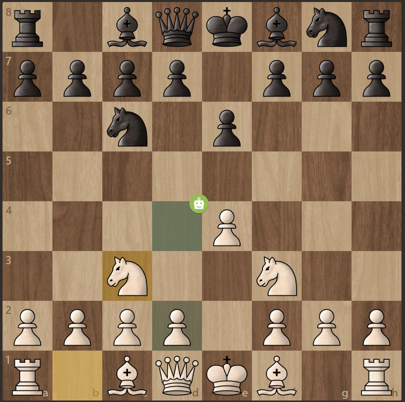

 

  

  <h3 align="center">Chess.com Analyzer</h3>

  

    🤖 Finding the best move on the board
     
    <a href="https://github.com/PRIME-AI-GITHUB/Dorsia"><strong>Explore the docs »</strong></a>
     
     
    <a href="https://github.com/PRIME-AI-GITHUB/Dorsia/issues">Report Bug</a>
    ·
    <a href="https://github.com/PRIME-AI-GITHUB/Dorsia/issues">Request Feature</a>
  

# About 
This project is a free and open-source solution for anyone who wants to learn how to play chess using [Stockfish](https://stockfishchess.org/), an open-source chess engine. It serves as a [Stockfish](https://stockfishchess.org/) interface for the website [Chess.com](https://www.chess.com/), where [Stockfish](https://stockfishchess.org/) highlights the best moves for players. The project is a great resource for beginners who want to improve their chess skills without having to pay for expensive chess training solutions.

All as a small chrome extension. 

## 💻 Features
You could provide a bullet-pointed list of the key features of your extension. This could include things like:

1. Highlighting the best move on the board
2. Using Stockfish for analysis and evaluation
3. Providing a free and open-source chess training solution
4. Working as a Chrome extension for easy use

## 🚀 Technologies Used
- 💻[WebAssembly](https://webassembly.org/): a binary instruction format so we can run Stockfish faster.
- 📜 [TypeScript](https://www.typescriptlang.org/): a typed superset of JavaScript that compiles to plain JavaScript.
- 🌐 [JavaScript](https://www.javascript.com/): a high-level programming language used for creating interactive web applications.
- 🔄 [Service Workers](https://developer.mozilla.org/en-US/docs/Web/API/Service_Worker_API): a technology used for caching and offline functionality in web applications.
- [♟️ Stockfish](https://stockfishchess.org/): an open-source chess engine used for analysis and evaluation of chess positions.
- 🤖 [UCI](https://en.wikipedia.org/wiki/Universal_Chess_Interface): a protocol used for communicating with chess engines like Stockfish.
- [🔌 Chrome API](https://developer.chrome.com/docs/extensions/reference/): a set of APIs used for creating extensions for Google Chrome.
- 📦 [Webpack](https://webpack.js.org/): for bundling

## Usage Instructions
To use this extension, follow the steps below:

1. Download and install the extension from the Chrome Web Store or from the GitHub repository.
2. Navigate to a chess game on Chess.com.
3. Click on the extension icon in your browser's toolbar.
4. Activate the extension and wait for it to analyze the game.
5. Once the analysis is complete, the extension will highlight the best move for you to make.1

## Development Instructions
1. Clone the repository to your local machine
2. Install the necessary dependencies by running npm install
3. To build the project, run npm run build
4. To run the extension in development mode, navigate to chrome://extensions/ in Google  Chrome and enable Developer mode. Then, click on "Load unpacked" and select the dist folder from the cloned repository.
5. Start a game on Chess.com and click on the extension icon to activate the extension and see the best move.

Note: Make sure to reload the extension after making any changes to the code by clicking on the "reload" button on the extension card in chrome://extensions/.

For more information on using Service Workers in Chrome, please refer to the Chrome Service [Worker API documentation.](https://developer.chrome.com/docs/extensions/reference/events/)

## Author
Samuel Hinchliffe
- [Author Website](https://samuel-hinchliffe.netlify.app/)
- [Author Github](https://github.com/Samuel-Hinchliffe)
- [Linkedin](https://www.linkedin.com/feed/)

